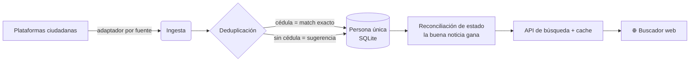

<div align="center">

# 🟡🔵🔴 vzla-finder

### Un solo buscador para encontrar a los desaparecidos del terremoto de Venezuela

Hay varias plataformas ciudadanas reportando personas desaparecidas, pero **ninguna cruza datos con la otra**.
Una familia tiene que buscar en cada una, por separado, una y otra vez.
**vzla-finder reúne todas en una sola búsqueda** — y si alguien ya fue reportado a salvo en cualquiera de ellas, lo ves al instante.

<br/>

[](https://vzlafinder.reandimo.dev)

[](LICENSE)


</div>

---

## ✨ Qué ofrece

| | |
|---|---|
| 🔎 **Búsqueda unificada** | Una consulta busca en todas las plataformas a la vez. |
| 🪪 **Por cédula `V-` y `E-`** | Coincidencia exacta. Los extranjeros (`E-`) **no** colisionan con venezolanos del mismo número. |
| 👥 **Resultados ricos para homónimos** | Cuando hay varias personas con el mismo nombre, distingue por edad, género, **sector/última referencia** y **foto**. |
| ✅ **La buena noticia gana** | Si cualquier fuente marca a alguien como *localizado*, el estado consolidado lo refleja — con quién lo reportó. |
| 🔗 **Vuelta a la fuente** | No re-hosteamos contactos: cada resultado enlaza a la ficha original. |
| 📋 **Fuentes a la vista** | El landing muestra qué plataformas se consultan y permite **sugerir nuevas**. |
| 🔒 **Privacidad primero** | Proyecto sin fines de lucro. No vendemos ni usamos tus datos para nada más. |
| ⚡ **Liviano y resiliente** | Frontend sin dependencias; carga rápido incluso en redes malas. |

---

## 🧠 Cómo funciona



1. **Ingesta** — un *adaptador* por plataforma trae los registros públicos (JSON o HTML).
2. **Normaliza** a un modelo común estilo PFIF (persona + procedencia + notas de estado).
3. **Deduplica en capas** — por **cédula** hace merge seguro entre plataformas; **sin** cédula, propone una coincidencia para revisión humana (**nunca** fusiona solo).
4. **Reconcilia el estado** — *localizado* de cualquier fuente consolida a “a salvo”, guardando quién y cuándo lo reportó.
5. **Sirve la búsqueda** — por cédula o nombre, con cache y enlaces de vuelta a cada fuente.

El **cacheo es cortés**: requests condicionales (`ETag`/`Last-Modified`/hash) evitan re-descargar lo que no cambió, y una fuente caída nunca frena a las demás.

---

## 🛰️ Fuentes

| Plataforma | Formato | Cédula | Estado |
|---|---|:---:|---|
| venezuelatebusca.com | JSON | ✅ | adaptador listo (modo fixtures) |
| desaparecidosterremotovenezuela.com | HTML | — | adaptador listo (modo fixtures) |
| estoyaquive.up.railway.app | JSON | ✅ | adaptador listo (modo fixtures) |
| venezuelareporta.org | JSON (API) | ✅ | planeada |

> Los adaptadores corren en **modo fixtures** (datos sintéticos) hasta conectar el endpoint real de cada plataforma — así nada se prueba contra servidores ajenos sin querer.
> ¿Conocés otra fuente? Sugerila desde el botón **“Sugerir otra fuente”** del landing, o abrí un issue.

---

## 🚀 Probar local (Node 22+)

```bash
npm install
npm run demo         # dedup por cédula + reconciliación + extranjeros (11 asserts)
npm run ingest       # ingiere las fuentes (fixtures por defecto)
npm run serve        # buscador en http://localhost:3000
npm run search -- --cedula "V-12.345.678"
npm run search -- --name "carlos marin"
```

> Usa `node:sqlite` (Node 22+). En Node 18/20, cambiá la import de `src/db.ts` por `better-sqlite3` (API casi idéntica).

---

## 🔌 API

| Endpoint | Qué hace |
|---|---|
| `GET /api/search?cedula=V-12.345.678` | Búsqueda exacta por cédula (`V-` o `E-`). |
| `GET /api/search?name=jose%20perez` | Búsqueda por nombre (resultados ricos para homónimos). |
| `GET /api/sources` | Plataformas consultadas + última sincronización. |
| `POST /api/suggest-source` | Recibe sugerencias de nuevas fuentes (`{ url, name?, note? }`). |

---

## 🤝 Conectar una fuente real

1. F12 → **Network → Fetch/XHR** en la plataforma, encontrá el request que devuelve el listado.
2. Pegá la URL en `ENDPOINT` del adaptador y ajustá `parse()` a la forma real del JSON/HTML.
3. Sumá el adaptador en `src/sources/index.ts`. Listo.

---

## 📦 Deploy

Corre en hosting compartido **cPanel / CloudLinux** (Passenger + cron) o en cualquier server con Node 22+. Pasos en **[DEPLOY.md](DEPLOY.md)**. La base de datos con datos personales vive **fuera del docroot** y nunca se versiona.

---

## 🔒 Privacidad y ética

Este es un **proyecto altruista, sin fines de lucro**. Solo reunimos en un mismo lugar lo que las plataformas ciudadanas **ya publican**, con enlace de vuelta a cada fuente. No vendemos, compartimos ni usamos los datos para nada que no sea ayudar a reunir a las personas con sus familias. Reglas que no se negocian:

- **Buen ciudadano de la web:** pull espaciado y cacheado.
- **Re-hostear lo mínimo:** para el contacto, se enlaza a la ficha original.
- **Nunca afirmar una coincidencia sin cédula:** se sugiere, no se decide.

🚨 **¿Es una emergencia?** En Venezuela, llamá al **171** (gestión de riesgos / Protección Civil).

---

<details>
<summary>📂 Estructura del proyecto</summary>

```
src/
  types.ts        modelo PFIF-lite + contratos de fuente/caché
  normalize.ts    cédula (V-/E-), nombre, similitud
  db.ts           almacenamiento + snapshots (node:sqlite)
  dedup.ts        resolución de persona
  reconcile.ts    "la buena noticia gana"
  ingest.ts       ingesta de registros
  runner.ts       cache + request condicional + ingesta
  scheduler.ts    loops por fuente (intervalo / jitter / backoff)
  cache.ts        query cache (TTL) para el buscador
  search.ts       búsqueda unificada
  server.ts       servidor HTTP (API + estático)
  cli.ts          CLI (ingest / watch / search)
  sources/        un adaptador por plataforma (+ base de fetch cortés)
public/index.html frontend read-only del buscador
scripts/          cron de cacheo
test/             pruebas e2e (dedup, estado, cache)
fixtures/         datos sintéticos (JSON + HTML)
```
</details>

---

<div align="center">

Hecho con ❤️ por **[Renan Díaz](https://github.com/reandimo)** · ¿Sumás una fuente o un fix? [Abrí un issue o PR](https://github.com/reandimo/vzla-finder/issues) · Licencia [MIT](LICENSE)

</div>
